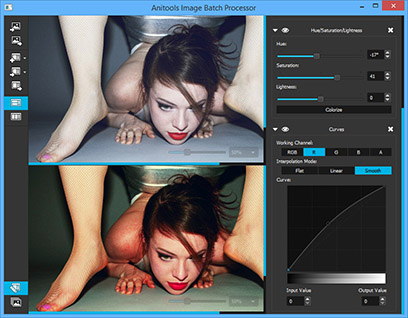
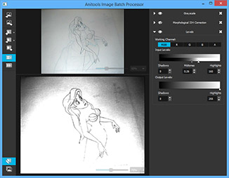
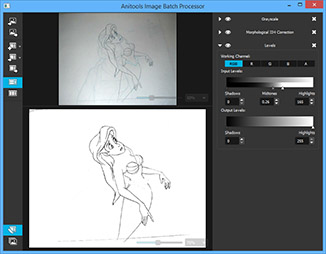
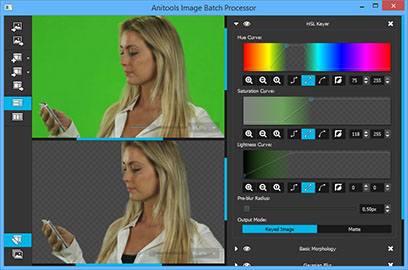

Image Batch Processor
========
The Image Batch Processor (or IBP for short) is a crossplatform, open source, simple tool writen in C++/Qt whose purpose is to transform one or more images in an automatic way based in a list of effects.

Who?
----
The main developer of IBP is Deif Lou, an independent illustrator ([tumblr blog](http://deiflou.tumblr.com)).

What?
----
IBP began being focused in traditional animation and the processing of several frames (e.g. cleaning cels).

IBP applies a list of effects to a list of images (useful if you want to transform/filter/modify a folder with hundreds of images/frames). The goal here is to provide the application with a set of filters that will help to achieve animation specific effects (non-uniform illumination correction, keying and so on).
This tool is under development. Here are some snapshots:

  
 
  The previous image shows the use of a generic color correction filter list.

   
 
  The previous images show a generic illumination correction filter list. The first image shows levels correction with no intensity inhomogeneity (IIH) correction. The second image applies a IIH correction filter before adjusting the levels.

  

  The previous image shows the use of a HSL keyer to remove unwanted color from the image.
  
Why?
----
The main reason why I am making this application is to help me in some specific tasks and minimize the amount of time required to do some repetitive work.
